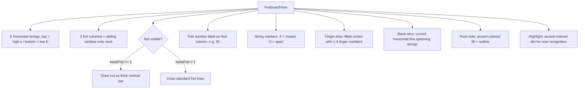

# Menu Bar Chords

A lightweight, native macOS menu bar app for guitarists to browse chords & scales, practice chord identification, and train note recognition on the fretboard. Only standard tuning is available. Zero dependencies. Built with SwiftUI.

🤖 Built with OpenCode using DeepSeek V4 Pro & Flash.

## Features

**Browse Mode**
- Select chord by root note + type (Major, Minor, 7, m7, Maj7, dim, aug, sus2, sus4)
- Select scale by root + type (Major, Minor, Major Pentatonic, Minor Pentatonic, Blues)
- Canvas-rendered mini fretboard with finger positions, barre arcs, X/O markers
- Multiple voicings per chord — step through them with a position stepper
- Chord name displayed above the fretboard

**Chord Identification Quiz**
- Random chord shape displayed on the fretboard (no name shown)
- Guess the root note + chord type from pickers
- Instant feedback: green "Correct!" or red "Nope!" with the right answer
- Score tracking: correct/total, percentage, current streak, best streak
- Persistent scores across relaunches

**Note Recognition**
- Pick a target string (E, A, D, G, B, e) or "Random"
- Position range filter: Open–5, 5–12, or Any
- Large prompt displays the note to find (e.g., "Find: C#")
- Reveal button highlights the correct fret on the fretboard
- Next Note generates a new random target

- **Audio**: Tap the play button next to any chord to hear it via built-in MIDI synthesis (5 guitar sounds)
- **Settings**: Menu bar icon, note naming (sharps/flats), popover size, guitar sound, quiz chord filter

**Interface**
- Popover lives in the menu bar — click the guitars icon to toggle
- Right-click context menu with About (opens GitHub) and Quit
- Segmented mode picker to switch between Browse / Quiz / Notes
- Persistent settings — selected root, chord type, scale type, position filter, quiz state all survive relaunch

## Build & run

### Requirements
- macOS 14 Sonoma or later
- Swift 5.10+ (comes with Command Line Tools)
- No Xcode required

### Quick start

```bash
# Build and run from source
swift run

# Or build a release .app bundle
scripts/bundle.sh
open build/Chords.app

# Run built-in data-integrity self-test
swift run Chords --selftest
```

The `.app` bundle is self-contained — copy it to `/Applications` and run it.

## Usage

| Action | How |
|---|---|
| **Open popover** | Click the guitars icon in your menu bar |
| **Browse chords** | Select Browse mode, pick Root + Type; use stepper for alternate voicings |
| **Browse scales** | Toggle Chord/Scale to Scale, pick Root + Type |
| **Hear a chord** | Tap the play button next to the chord name in Browse mode |
| **Start quiz** | Select Quiz mode — pick All or Open chords |
| **Random chord** | A random chord shape appears on the fretboard |
| **Guess a chord** | Pick Root + Type from the pickers, click Check |
| **Advance quiz** | Click Next Chord after answering |
| **Practice notes** | Select Notes mode, choose a string |
| **Reveal answer** | Click Reveal to see the note highlighted on the fretboard |
| **Next note** | Click Next Note for a new target |
| **Open settings** | Click the gear icon at the bottom of the popover |
| **Quit** | Right-click the menu bar icon → Quit (or `⌘Q`) |

## Architecture

```
┌──────────────────────────────────────────────────────────────────────────┐
│                          ChordsApp (@main)                               │
│  SwiftUI Settings scene ── AppDelegate owns NSStatusItem + NSPopover     │
│        │                                                                │
│        ├── statusItem: NSStatusItem (menuBarIconName SF Symbol)            │
│        └── popover: NSPopover ── NSHostingController ── ContentView       │
│  SelfTest: swift run Chords --selftest validates all model data             │
├──────────────────────────────────────────────────────────────────────────┤
│                          AppModel (@Observable)                          │
│  Central state: selectedMode, browseMode, selectedRoot, chordType, etc.  │
│  Coordinates: ChordLibrary, ScaleLibrary, QuizState, persistence,        │
│               AudioEngine, noteNaming, popoverSize, guitarSound            │
├──────────────────────────────────────────────────────────────────────────┤
│  ContentView ── modePicker <Browse|Quiz|Notes>                           │
│    ├── SettingsView (gear icon toggle)                                     │
│    │   ├── iconRow (menu bar icon picker)                                │
│    │   ├── namingRow (notes: sharps / flats)                            │
│    │   ├── sizeRow (popover: Compact / Spacious)                        │
│    │   ├── soundRow (guitar sound: Nylon, Steel, Clean, Overdrive, Dist)│
│    │   └── quizRow (filter: All / Open only)                            │
│    ├── BrowseView                                                       │
│    │   ├── browseModePicker (Chord|Scale)                               │
│    │   ├── rootPicker (PopUpButtonPicker) + typePicker                  │
│    │   ├── FretboardView (Canvas rendering)                              │
│    │   ├── playButton (MIDI chord playback)                              │
│    │   └── PositionStepper (multiple voicings)                         │
│    ├── ChordQuizView                                                    │
│    │   ├── FretboardView (random chord, no name)                         │
│    │   ├── guessControls (root + type PopUpButtonPickers, Check button) │
│    │   ├── resultView (Correct!/Nope!)                                  │
│    │   └── scoreDisplay + Next Chord button                              │
│    └── NoteRecognitionView                                              │
│        ├── stringSelector (Random or specific string)                    │
│        ├── positionFilterPicker (Open–5 | 5–12 | Any)                   │
│        ├── notePrompt ("Find: C#")                                      │
│        ├── FretboardView (highlighted note on reveal)                    │
│        └── Reveal + Next Note buttons                                   │
└──────────────────────────────────────────────────────────────────────────┘
```

## Fretboard rendering

The mini fretboard is drawn with SwiftUI `Canvas` — no external graphics libraries.



- Width: 260pt, height fits 6 strings with top/bottom margins
- String spacing: 16pt
- Fret spacing: equal columns
- Semantic colors (`Color.primary`, `.accentColor`) — native dark mode support

## Data model

```
Note           12 chromatic notes, interval math, fret calculation per string
GuitarString   Standard tuning E2 A2 D3 G3 B3 E4, fret(for:) with range filter

ChordDefinition  root + type + positions
├── ChordType    major, minor, dominant7, minor7, major7, diminished, augmented, sus2, sus4
└── ChordPosition  frets[6], fingers[6], barres[], baseFret

ScaleDefinition  root + type + positions
├── ScaleType     major, naturalMinor, majorPentatonic, minorPentatonic, blues
└── ScalePosition  notes[6][3], baseFret
```

Preloaded with open chords (C, A, G, E, D shapes), E-shape and A-shape barre chords in all keys, plus all 12 keys × 5 scale types with CAGED-aligned positions.

## Project structure

```
menu-bar-chords/
├── Package.swift              # SPM executable, macOS 14+, strict concurrency
├── README.md
├── CHANGELOG.md
├── INTENTION.md               # Detailed design document
├── Resources/
│   ├── Info.plist             # LSUIElement=YES, bundle metadata
│   └── Chords.entitlements    # Hardened runtime (no sandbox)
├── scripts/
│   ├── bundle.sh              # Builds release → assembles Chords.app
│   └── test.sh                # Runs XCTests + self-test CLI
├── Sources/
│   ├── Chords/                # Executable — views & app entry
│   │   ├── ChordsApp.swift    # @main, AppDelegate, NSStatusItem + NSPopover
│   │   ├── ContentView.swift  # Mode selector + routed content + settings toggle
│   │   ├── FretboardView.swift # Canvas-based mini fretboard
│   │   ├── BrowseView.swift   # Chord/scale reference browser
│   │   ├── ChordQuizView.swift # Chord identification quiz
│   │   ├── NoteRecognitionView.swift # Note finding trainer
│   │   ├── SettingsView.swift # Settings panel (icon, naming, size, sound, quiz filter)
│   │   ├── PopUpButtonPicker.swift # NSPopUpButton wrapper (fixes macOS 14+ crash)
│   │   └── SelfTest.swift     # CLI data-integrity self-test runner
│   └── ChordsLib/             # Library — models & data
│       └── Models/
│           ├── AppModel.swift       # @Observable central state, persistence
│           ├── Note.swift           # Note enum, interval math, string/fret mapping
│           ├── ChordDefinition.swift # Chord data structures
│           ├── ChordLibrary.swift    # Static chord database (open & barre)
│           ├── ScaleDefinition.swift # Scale data structures
│           ├── ScaleLibrary.swift    # Static scale database
│           ├── QuizState.swift       # Quiz scoring, streak logic
│           └── AudioEngine.swift     # AVAudioEngine DLS Synth MIDI playback
├── Tests/
│   └── ChordsTests/
│       ├── AppModelTests.swift
│       ├── ChordLibraryTests.swift
│       ├── NoteTests.swift
│       └── QuizStateTests.swift
└── .gitignore
```

## Security model

This app is **unsandboxed** with **hardened runtime** and **ad-hoc signed**. It's a local utility with no network access (except opening a URL on "About"), no file I/O, and no sensitive data. The only permission it requires is:

- Audio output (uses built-in iOS MIDI synthesis)

Unsandboxed status is required for reliable `NSStatusItem` + `NSPopover` behavior, matching all major macOS menu bar utilities (Bartender, iStat Menus, etc.).

## Dependencies

**Zero.** The entire app uses only system frameworks:
- SwiftUI
- AppKit / Foundation
- Observation

No CocoaPods, no SPM packages, no Electron.

## License

MIT
